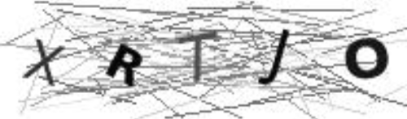
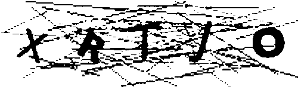
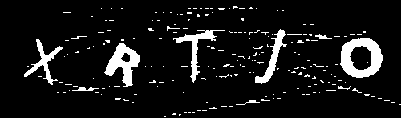
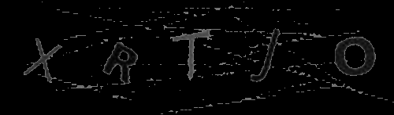
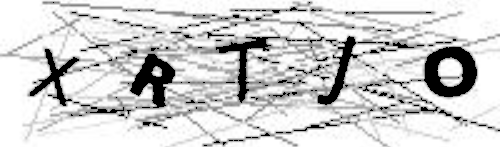
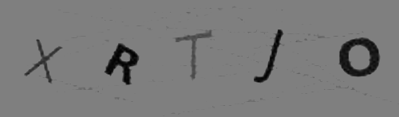
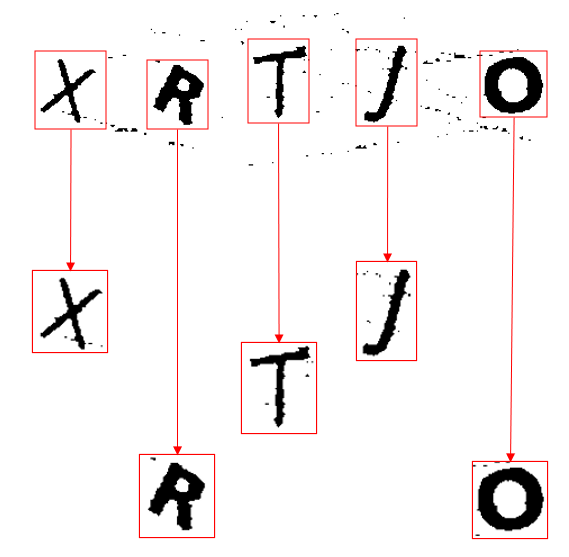
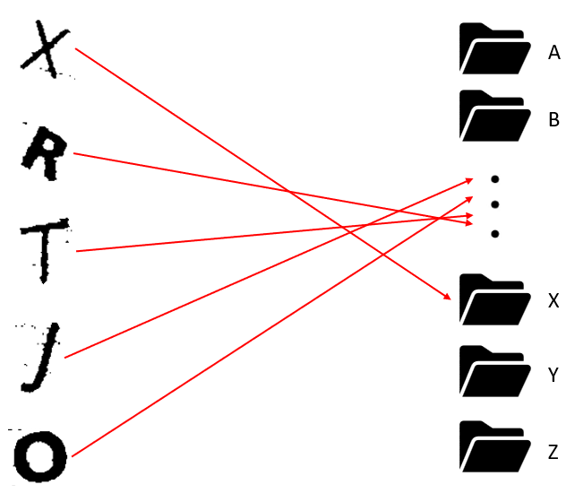
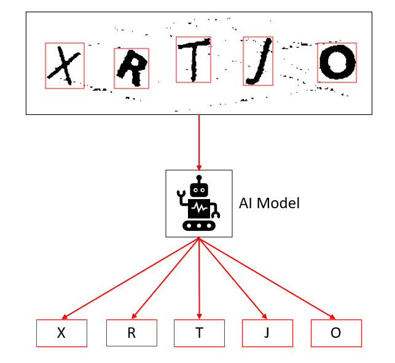

# Captcha Breaker

## Project's Objective

Developing a sophisticated AI model with the capability to effectively decipher and
overcome a targeted category of CAPTCHA challenges.

### Packages used:

+ keras.models
+ keras.layers
+ sklearn.preprocessing
+ sklearn.model_selection
+ cv2
+ helpers
+ imutils
+ numpy
+ pickle
+ glob
+ os
+ PIL

## Steps to the Solution

## 1) Database

 This project contains 248 text-based CAPTCHAs, each of them carries 5 different letters
that need to be identified by the solver (in this case, the AI we're building) totaling a
database of 1240 images.

| Example                                   |
|-------------------------------------------|
|  |

## 2) Image/Database Processing

In "teste_modelo.py" 5 different Image Processing Methods are applied and tested: THRESH_BINARY, 
THRESH_BINARY_INV, THRESH_TRUNC, THRESH_TOZERO and THRESH_TOZERO_INV.

| THRESH_BINARY                                             | THRESH_BINARY_INV                                       |
|-----------------------------------------------------------|---------------------------------------------------------|
|   |  |

| THRESH_TOZERO_INV                                        | THRESH_TOZERO                                            |
|----------------------------------------------------------|----------------------------------------------------------|
|  |  |

| THRESH_TRUNC                                             |
|----------------------------------------------------------|
|  |

 For this scenario the chosen method was THRESH_TRUNC. Therefore, "tratar_captcha.py" is responsible
for applying the method in all images contained in the database and save the processed result in 
"imgs_ajustadas" folder.

## 3) Separate Letters

In "separar_letras.py" we identify the contour of each letter by determining a minimal area of
clustered points, anything below that threshold will not be considered a "letter" and will be discarded.

After the contour is defined, a rectangle is created around that contour so that we can finally
crop each individual letter and save them in different image files.

## 4) Manual Categorization

This step consists in manually separate every images in different folders for a total of
26 folders (1 for each letter). With this, the final database is ready to be used for the AI Training.

## 5) Training Artificial Intelligence Model and Solving CAPTCHAs

In "treinar_modelo.py" we utilize scikit-learn and Keras to create and train an AI Model by using
the previously mentioned database and a Neural Network Algorithm.

With the "modelo_treinado.hdf5" AI Model trained we can finally use it to solve CAPTCHAs. 
"resolver_captcha.py" is an example of how to utilize the trained model.
